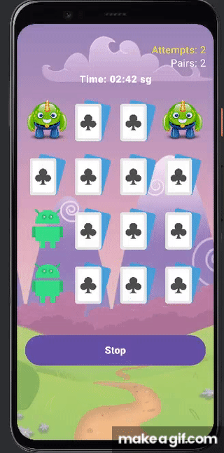

# Memory Game Android

Um jogo de memória com diversas imagens do Bugdroid

<h1 align="center">
  
  
</h1>

## 🚀 Começando

Baixe o projeto e sincronize as dependências no android studio para iniciar.

### 📋 Pré-requisitos

Android Studio

## 🛠️ Construído com

* [Kotlin - Jetpac Compose](https://developer.android.com/compose)

<!--
## 🖇️ Colaborando

Por favor, leia o [COLABORACAO.md](https://gist.github.com/usuario/linkParaInfoSobreContribuicoes) para obter detalhes sobre o nosso código de conduta e o processo para nos enviar pedidos de solicitação.

## 📌 Versão

Nós usamos [SemVer](http://semver.org/) para controle de versão. Para as versões disponíveis, observe as [tags neste repositório](https://github.com/suas/tags/do/projeto). 

## ✒️ Autores

Mencione todos aqueles que ajudaram a levantar o projeto desde o seu início

* **Um desenvolvedor** - *Trabalho Inicial* - [umdesenvolvedor](https://github.com/linkParaPerfil)
* **Fulano De Tal** - *Documentação* - [fulanodetal](https://github.com/linkParaPerfil)

Você também pode ver a lista de todos os [colaboradores](https://github.com/usuario/projeto/colaboradores) que participaram deste projeto.

## 📄 Licença

Este projeto está sob a licença (sua licença) - veja o arquivo [LICENSE.md](https://github.com/usuario/projeto/licenca) para detalhes.

## 🎁 Expressões de gratidão

* Conte a outras pessoas sobre este projeto 📢;
* Convide alguém da equipe para uma cerveja 🍺;
* Um agradecimento publicamente 🫂;
* etc.

-->
